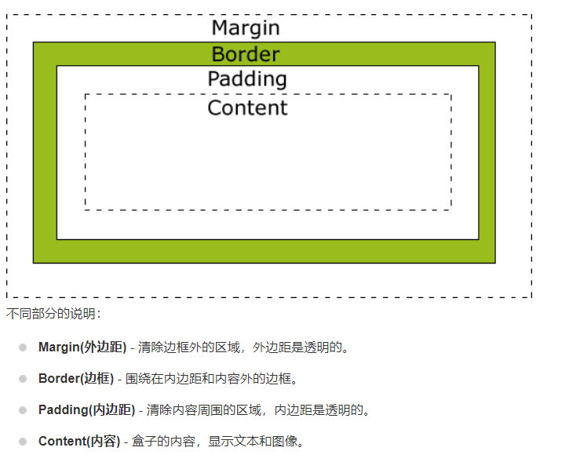

### CSS的书写方式

    【1】内联样式：
    【2】内部样式：
    【3】外部样式：
    【4】实际开发中三种书写方式用的最多的是：
         第三种：外部样式：因为这种方式真正做到了  元素页面和样式 分离
    【5】三种书写方式优先级 ：就近原则

【1】内联样式：

```html
<!DOCTYPE html>
<html lang="zh-CN">
<head>
    <meta charset="UTF-8">
    <title></title>
</head>
<body>
    <!--
        书写方式：内联样式（行内样式）
        在标签中加入一个style属性，CSS的样式作为属性值
        多个属性值之间用;进行拼接
    -->
    <h1 style="color: deeppink;font-family: '宋体';">这是一个h1标题</h1>
</body>
</html>
```

【2】内部样式：

```html
<!DOCTYPE html>
<html lang="zh-CN">
<head>
    <meta charset="UTF-8">
    <title></title>
    <!--
        书写方式：内部样式：
        head标签中加入一个style标签，在里面定位到你需要修饰的元素，然后在{}中加入你要修饰的样式。
    -->
    <style type="text/css">
        h1 {
            color: royalblue;
            font-family: 宋体;
        }
    </style>
</head>
<body>
    <h1>这是一个标题</h1>
</body>
</html>
```

【3】外部样式：

    <!--首先要创建一个css文件，css文件的后缀.css-->
    h1{
        color: red;
        font-family: 宋体;
    }

```html
<!DOCTYPE html>
<html lang="zh-CN">
<head>
    <meta charset="UTF-8">
    <title></title>
    <!--引入外部CSS资源：link-->
    <link rel="stylesheet" type="text/css" href="css/mystyle.css"/>
</head>
<body>
    <h1>这是一个标题</h1>
</body>
</html>
```

### 选择器

- 基本选择器
- 关系选择器
- 属性选择器
- 伪类选择器

#### 基本选择器

    优先级别：id选择器>class选择器>元素选择器：

```html
<!DOCTYPE html>
<html lang="zh-CN">
<head>
    <meta charset="UTF-8">
    <title></title>
    <style type="text/css">
        /*
         【1】基本选择器：元素选择器：
         通过元素的名字进行定位，它会获取页面上所有这个元素，无论藏的多深都可以获取到
         格式：
         元素名字{
             css样式;
         }
         * */
        h1 {
            color: red;
        }

        i {
            color: blue;
        }

        /*
         【2】基本选择器：类选择器
         应用场合：不同类型的标签使用相同的类型
         格式：
         .class的名字{
             css样式;
         }
         */
        .mycls {
            color: green;
        }

        /*
         【3】基本选择器：id选择器：
         应用场合：可以定位唯一的一个元素
         不同的标签确实可以使用相同的id，但是一般我们会进行人为的控制，让id是可以唯一定位到一个元素。
         格式：
         #id名字{
             css样式;
         }
         */
        #myid {
            color: yellow;
        }
    </style>
</head>
<body>
    <h1>我是<i>一个</i>标题</h1>
    <h1>我是一个标题</h1>
    <h1 class="mycls">我是一个标题</h1>
    <h1>我是一个标题</h1>
    <h2 class="mycls">我是h2标题</h2>
    <h2>我是h2标题</h2>
    <h2 id="myid">我是h2标题</h2>
</body>
</html>
```

#### 关系选择器

    div 和 span
    div和span 结合css用于页面的布局。div+css 用于页面布局。

```html
<!DOCTYPE html>
<html lang="zh-CN">
<head>
    <meta charset="UTF-8">
    <title></title>
    <style type="text/css">
        /*
         我们可以通俗的理解，把div理解为一个“塑料袋”
         div属于块级元素--》换行
         span属于行内元素--》没有换行效果
         span:里面的内容占多大，span包裹的区域就多大
         */
        div {
            border: 1px red solid;
        }

        span {
            border: 1px greenyellow solid;
        }
    </style>
</head>
<body>
    <div>马士兵马士兵<br/>马士兵马士兵</div>
    <div>马士兵</div>
    <span>马士兵马士兵</span>
    <span>马士兵</span>
    <span>马士兵</span>
</body>
</html>
```

```html
<!DOCTYPE html>
<html lang="zh-CN">
<head>
    <meta charset="UTF-8">
    <title></title>
    <style type="text/css">
        /*关系选择器:
         * 后代选择器：只要是这个元素的后代，样式都会发生变化
         * div下面的所有h1标签样式都会改变
         */
        /*div h1{
                color: red;
        }*/
        /*关系选择器：子代选择器
         只改变子标签的样式*/
        div > h1 {
            color: royalblue;
        }

        span > h1 {
            color: yellow;
        }
    </style>
</head>
<body>
    <div>
        <h1>这是标题</h1>
        <h1>这是标题</h1>
        <h1>这是标题</h1>
        <h1>这是标题</h1>
        <h1>这是标题</h1>
        <span>
            <h1>这是标题</h1>
            <h1>这是标题</h1>
            <h1>这是标题</h1>
            <h1>这是标题</h1>
            <h1>这是标题</h1>
        </span>
    </div>

</body>
</html>

```

#### 属性选择器

```html
<!DOCTYPE html>
<html lang="zh-CN">
<head>
    <meta charset="UTF-8">
    <title></title>
    <style type="text/css">
        /*属性选择器*/
        input[type="password"] {
            background-color: red;
        }

        input[type="text"][value="zhaoss1"] {
            background-color: yellow;
        }

    </style>
</head>
<body>
    <form>
        用户名：<input type="text" value="zhaoss1"/>
        用户名2：<input type="text" value="zhaoss2"/>
        密码：<input type="password" value="123123"/>
        <input type="submit" value="登录"/>
    </form>
</body>
</html>

```

#### 伪类选择器

    伪类选择器  向某些选择器添加特殊效果。

```html
<!DOCTYPE html>
<html>
<head>
    <meta charset="UTF-8">
    <title></title>
    <style type="text/css">
        /*设置静止状态*/
        a:link {
            color: yellow;
        }

        /*设置鼠标悬浮状态*/
        a:hover {
            color: red;
        }

        /*设置触发状态*/
        a:active {
            color: blue;
        }

        /*设置完成状态*/
        a:visited {
            color: green;
        }
    </style>
</head>
<body>
    <a href="index.html">超链接</a>
</body>
</html>
```

#### 盒子模型


