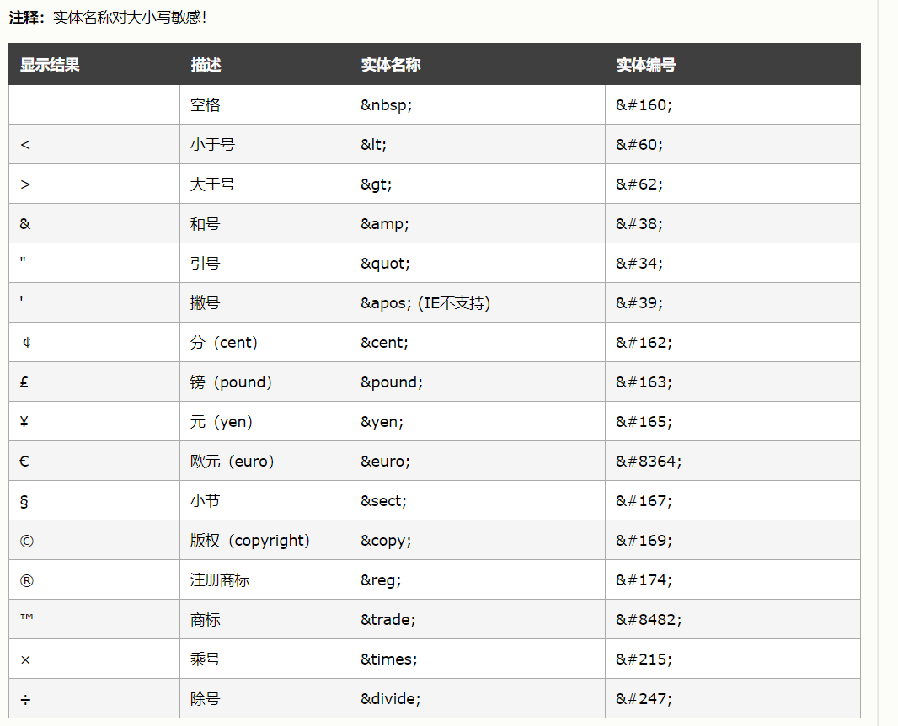

## HTML的标准结构

```html

<html lang="zh-CN">
<head>
    <title>标题</title>
</head>
<body>
    第一个html....
</body>
</html>
```

## HTML的标签

|标签|作用|
|---|---|
|`<html> </html>` |定义 HTML 文档 |
|`<head> </head>` | 定义文档的头部 |
|`<body> </body>` | 用户可以看到的内容 |

## head中可用标签

```html

<html lang="zh-CN">
<!--
        head标签中：放入：页面的配置信息
        head标签中可以加入：
        <title>、<meta>、<link>、<style>、 <script>、 <base>。
-->
<head>
    <!--页面标题-->
    <title>百度一下，你就知道</title>
    <!--设置页面的编码，防止乱码现象
            利用meta标签，
            charset="utf-8" 这是属性，以键值对的形式给出  k=v a=b 
            告诉浏览器用utf-8来解析这个html文档
    -->
    <meta charset="utf-8"/><!--简写-->
    <!--繁写形式：（了解）-->
    <!--<meta http-equiv="content-type" content="text/html;charset=utf-8" />-->
    <!--页面刷新效果-->
    <!--<meta http-equiv="refresh" content="3;https://www.baidu.com" />-->
    <!--页面作者-->
    <meta name="author" content="msb;213412@qq.com"/>
    <!--设置页面搜索的关键字-->
    <meta name="keywords" content="马士兵教育;线上培训;架构师课程"/>
    <!--页面描述-->
    <meta name="description" content="马士兵教育详情页"/>
    <!--link标签引入外部资源-->
    <link rel="shortcut icon" href="https://www.baidu.com/favicon.ico" type="image/x-icon"/>
</head>
<!--
        body标签中：放入：页面展示的内容
-->
<body>
    this is a html...你好
</body>
</html>
```

## body中可用标签

### 文本标签

```html

<body>
    <!--文本标签-->
    <!--下面的文字就是普通的文本，文本编辑器中的任何效果：比如空格，换行 都不影响页面，
            页面想要实现效果 必须通过标签来实现
    -->
    媒体：为人父母，要不要“持证上岗”？
    <!--标题标签
        h1-h6  字号逐渐变小，每个标题独占一行，自带换行效果
        h7之后都属于无效标签，但是浏览器也不会报错，而是以普通文本的形式进行展现
    -->
    <h1>媒体：为人父母，要不要“持证上岗”？</h1>
    <!--横线标签
        width:设置宽度
        300px ：固定宽度
        30%：页面宽度的百分比，会随着页面宽度的变化而变化
        align：设置位置  left ,center,right    默认不写的话就是center居中效果
    -->
    <hr width="300px" align="center"/>
    <hr width="30%" align="center"/>

    <!--段落标签：
    段落效果：段落中文字自动换行，段落和段落之间有空行
    -->
    <p></p>
    <!--加粗倾斜下划线-->
    <b>加粗</b>
    <i>倾斜</i>
    <u>下划线</u>
    <i><u><b>加粗倾斜下划线</b></u></i>
    <!--一箭穿心-->
    <del>你好 你不好</del>
    <!--预编译标签：在页面上显示原样效果-->
    <pre>
            public static void main(String[] args){
                    System.out.println("hello msb....");
            }
        </pre>
    <!--换行-->
    5月26日，“建议父母持合格父母证上岗”冲上微博<br/>热搜，迅速引发热议。在正在召开的全国两会上，全国政
    <!--字体标签-->
    <font color="#397655" size="7" face="萝莉体 第二版">建议父母持合格父母证上岗</font>

</body>

```

### 实体字符



### 多媒体标签

```html

<body>
    <!--图片
    src:引入图片的位置
            引入本地资源
            引入网络资源
    width:设置宽度
    height:设置高度
    注意:一般高度和宽度只设置一个即可，另一个会按照比例自动适应
    title:鼠标悬浮在图片上的时候的提示语，默认情况下（没有设置alt属性） 图片如果加载失败那么提示语也是title的内容
    alt:图片加载失败的提示语
    -->
    <!-- 现在已经不建议使用 <embed> 标签了，可以使用 、<iframe>、<video>、<audio> 等标签代替。 -->
    
    <embed type="image/jpg" src="https://static.runoob.com/images/runoob-logo.png" width="258" height="39">

    <!--音频-->
    <!-- <embed> 标签是 HTML 5 中的新标签。-->
    <!--        <embed src="music/我要你.mp3"></embed>-->

    <br/>
    <!--视频-->
    <embed type="video/webm" src="https://www.runoob.com/try/demo_source/movie.mp4" width="400" height="300">
    <embed src="https://www.runoob.com/try/demo_source/movie.mp4" width="400" height="300"
    "></embed>
</body>

```

### 超链接

```html

<body>
    <!--超链接标签：作用：实现页面的跳转功能
        href:控制跳转的目标位置
        target:_self 在自身页面打开 （默认效果也是在自身页面打开）    _blank 在空白页面打开
    -->
    <a href="https://www.baidu.com" target="_self">这是一个超链接04</a>
    <a href="https://www.baidu.com" target="_blank">这是一个超链接05</a>

    <a href="https://www.baidu.com" target="_blank">
        
    </a>
</body>

```

#### 设置锚点

```html

<body>
    <a name="1F"></a>
    <h1>手机</h1>
    <p>华为p40</p>
    <p>华为p40</p>
    <a name="2F"></a>
    <h1>化妆品</h1>
    <p>大宝</p>
    <p>大宝</p>
    <a name="3F"></a>
    <h1>母婴产品</h1>
    <p>奶粉</p>
    <p>奶粉</p>
    <a name="4F"></a>
    <h1>图书</h1>
    <p>thinking in java</p>
    <p>thinking in java</p>
    <a href="#1F">手机</a>
    <a href="#2F">化妆品</a>
    <a href="#3F">母婴产品</a>
    <a href="#4F">书籍</a>
</body>

```

**设置锚点**

```html

<body>
    <a href="设置锚点.html#3F">超链接</a>
</body>

```

### 列表标签

```html

<body>
    <!--无序列表:
            type:可以设置列表前图标的样式   type="square"
            如果想要更换图标样式，需要借助css技术： style="list-style:url(img/act.jpg) ;"
    -->
    <h1>起床以后需要做的事</h1>
    <ul type="square">
        <li>睁眼</li>
        <li>穿衣服</li>
        <li>上厕所</li>
        <li>吃早饭</li>
        <li>洗漱</li>
        <li>出门</li>
    </ul>
    <!--有序列表:
            type:可以设置列表的标号：1,a,A,i,I
            start:设置起始标号
    -->
    <h1>学习java的顺序</h1>
    <ol type="A" start="3">
        <li>JavaSE</li>
        <li>ORACLE</li>
        <li>MYSQL</li>
        <li>HTML</li>
        <li>CSS</li>
        <li>JS</li>
    </ol>

</body>


```

### 表格标签

```html

<body>
    <!--表格：4行4列
        table:表格
        tr:行
        td:单元格
        th:特殊单元格：表头效果：加粗，居中
        默认情况下表格是没有边框的，通过属性来增加表框：
        border:设置边框大小
        cellspacing：设置单元格和边框之间的空隙
        align="center"  设置居中
        background 设置背景图片 background="img/ss.jpg"
        bgcolor :设置背景颜色
        rowspan:行合并
        colspan：列合并
    -->
    <table border="1px" cellspacing="0px" width="400px"
    " bgcolor="darkseagreen">
    <tr bgcolor="bisque">
        <th>学号</th>
        <th>姓名</th>
        <th>年纪</th>
        <th>成绩</th>
    </tr>
    <tr>
        <td align="center">1001</td>
        <td>丽丽</td>
        <td>19</td>
        <td rowspan="3">90.5</td>
    </tr>
    <tr>
        <td colspan="2" align="center">2006</td>
        <td>30</td>
    </tr>
    <tr>
        <td>3007</td>
        <td>小明</td>
        <td>18</td>
    </tr>
    </table>
</body>
```

### 框架标签

#### 内嵌框架

```html

<iframe src=" URL "></iframe>

<iframe src="书籍导航页面.html" height="700px" width="30%"></iframe>
<!--内嵌框架-->
<iframe name="iframe_my" width="67%" height="700px" src="img/think in java.jpg"></iframe>
```

#### 框架集合

> frameset 元素可定义一个框架集。它被用来组织多个窗口（框架）。每个框架存有独立的文档。在其最简单的应用中，frameset 元素仅仅会规定在框架集中存在多少列或多少行。您必须使用 cols 或 rows 属性。 里面如果只有一个框架用frame标签,如果多个框架用frameset标签,用cols 或 rows进行行，列的切割
>

```html
<!DOCTYPE html>
<html lang="zh-CN">
<head>
    <meta charset="UTF-8">
    <title></title>
</head>
<!--框架集合：和body是并列的概念，不要将框架集合放入body中-->
<frameset rows="20%,*,30%">
    <frame/>
    <frameset cols="30%,40%,*">
        <frame/>
        <frame src="index.html"/>
        <frame/>
    </frameset>
    <frameset cols="50%,*">
        <frame/>
        <frame/>
    </frameset>
</frameset>
</html>
```

### form表单

```html
<!DOCTYPE html>
<html lang="en">
<head>
    <meta charset="UTF-8">
    <title></title>
</head>
<body>
    <!--定义form表单:form表单会采集包含的有效数据，提交到后端，进行交互-->
    <!--
        【1】action属性
        地址栏信息：
        http://127.0.0.1:8020/Form%E8%A1%A8%E5%8D%95/aaa?username=nana&pwd=123123
        
        ?之前是提交的资源的目标地址
        ?之后是提交的具体的数据 
        Form%E8%A1%A8%E5%8D%95：指的是你的项目名字：Form表单
        PS：浏览器的地址栏是不支持中文的，都会转成编码传送，如果你在地址栏看到中文，只是当前的那个浏览器给你一个友好的显示
        PS:可以使用在线解析工具查看：urlencode
        aaa:目标资源 --》去当前项目下找aaa了
        
        ?后的内容：
        username=nana&pwd=123123
        我们写的文本框，密码框等必须要加入一个属性：name
        然后name属性和具体录入的信息会拼成一个键值对的形式
        多个键值对之间 ，用&符号进行拼接
        
        PS：只有放在form表单中的内容才会被收集并提交
        
        【2】method属性：默认情况下不写method属性的时候就相当于method="get"
        get方式：提交数据可见，不安全，提交数据长度有限制，效率高
        post方式 ：提交数据不可见，安全，提交数据长度没有限制，效率低
    -->
    <form action="aaa" method="post">
        用户名：<input type="text" name="username"/><br/>
        密码：<input type="password" name="pwd"/><br/>
        <!--提交按钮-->
        <input type="submit"/>
    </form>
    用户名2：<input type="text" name="username2"/>
</body>
</html>

```

#### 模拟百度搜索

```html
<!DOCTYPE html>
<html lang="en">
<head>
    <meta charset="UTF-8">
    <title>百度一下，你就知道</title>
    <link rel="shortcut icon" href="https://www.baidu.com/favicon.ico" type="image/x-icon"/>
</head>
<body>
    <form action="https://www.baidu.com/s" method="get">
        <!--文本框-->
        <input type="text" name="wd"/>
        <!--提交按钮-->
        <input type="submit" value="百度一下"/>
    </form>
</body>
</html>

```

#### 表单元素

```html
<!DOCTYPE html>
<html lang="zh-CN">
<head>
    <meta charset="UTF-8">
    <title></title>
</head>
<body>
    <form action="" method="get">
        <!--表单元素-->
        <!--文本框:
        input标签使用很广泛，通过type属性的不同值，来表现不同的形态。
        type="text"  文本框，里面文字可见
        表单元素必须有一个属性：name 有了name才可以提交数据,才可以采集数据
        然后提交的时候会以键值对的形式拼到一起。
        value:就是文本框中的具体内容
        键值对：name=value的形式
        如果value提前写好，那么默认效果就是value中内容。
        一般默认提示语：用placeholder属性，不会用value--》value只是文本框中的值。
        
        readonly只读：只是不能修改，但是其他操作都可以，可以正常提交
        disabled禁用：完全不用，不能正常提交
        
        写法：
        readonly="readonly"
        readonly
        readonly = "true"
        -->
        <input type="text" name="uname" placeholder="请录入身份证信息"/>
        <input type="text" name="uname2" value="123123" readonly="true"/>
        <input type="text" name="uname3" value="456456" disabled="disabled"/>
        <!--密码框:效果录入信息不可见-->
        <input type="password" name="pwd"/>
        <!--单选按钮：
        注意：一组单选按钮，必须通过name属性来控制，让它们在一个分组中，然后在一个分组里只能选择一个
        正常状态下，提交数据为：gender=on ，后台不能区分你提交的数据
        不同的选项的value值要控制为不同，这样后台接收就可以区分了
        
        默认选中：checked="checked"
        -->
        性别：
        <input type="radio" name="gender" value="1" checked="checked"/>男
        <input type="radio" name="gender" value="0"/>女

        <!--多选按钮:
        必须通过name属性来控制，让它们在一个分组中，然后在一个分组里可以选择多个
        不同的选项的value值要控制为不同，这样后台接收就可以区分了
        多个选项提交的时候，键值对用&符号进行拼接：例如下：
        favlan=1&favlan=3
        -->
        你喜欢的语言：
        <input type="checkbox" name="favlan" value="1" checked="checked"/>java
        <input type="checkbox" name="favlan" value="2" checked="checked"/>python
        <input type="checkbox" name="favlan" value="3"/>php
        <input type="checkbox" name="favlan" value="4"/>c#

        <!--文件-->
        <input type="file"/>
        <!--隐藏域-->
        <input type="hidden" name="uname6" value="123123"/>
        <!--普通按钮：普通按钮没有什么效果，就是可以点击，以后学了js，可以加入事件-->
        <input type="button" value="普通按钮"/>
        <!--特殊按钮：重置按钮将页面恢复到初始状态-->
        <input type="reset"/>
        <!--特殊按钮：图片按钮-->
        
        <input type="image" src="img/java核心技术.jpg"/>


        <!--下拉列表
                默认选中：selected="selected"
                多选：multiple="multiple"
        -->
        你喜欢的城市：
        <select name="city" multiple="multiple">
            <option value="0">---请选择---</option>
            <option value="1">哈尔滨市</option>
            <option value="2" selected="selected">青岛市</option>
            <option value="3">郑州市</option>
            <option value="4">西安市</option>
            <option value="5">天津市</option>
        </select>

        <!--多行文本框
                利用css样式来控制大小不可变：style="resize: none;"
        -->
        自我介绍：
        <textarea style="resize: none;" rows="10" cols="30">请在这里填写信息。。</textarea>
        <br/>
        <!--label标签
                一般会在想要获得焦点的标签上加入一个id属性，然后label中的for属性跟id配合使用。
        -->
        <label for="uname">用户名：</label><input type="text" name="uername" id="uname"/>

        <!--特殊按钮：提交按钮：具备提交功能-->
        <input type="submit"/>
    </form>
</body>
</html>
```

#### HTML5新增type类型

```html
<!DOCTYPE html>
<html lang="zh-CN">
<head>
    <meta charset="UTF-8">
    <title></title>
</head>
<body>
    <form action="" method="get">
        <!--email:
                html5的类型可以增加校验
        -->
        <input type="email" name="email"/>
        <!--url-->
        <input type="url"/>
        <!--color-->
        <input type="color"/>
        <!--number:
                min:最小值
                max:最大值
                step:步长
                value:默认值：一定在步长的范围中，否则不能提交
        -->
        <input type="number" min="1" max="10" step="3" value="4"/>
        <!--range-->
        1<input type="range" min="1" max="10" name="range" step="3"/>10
        <!--date-->
        <input type="date"/>
        <!--month-->
        <input type="month"/>
        <!--week-->
        <input type="week"/>
        <!--提交按钮-->
        <input type="submit"/>
    </form>
</body>
</html>
```

#### HTML5新增属性

```html
<!--
    HTML5新增属性：
    multiple：多选
    placeholder:默认提示
    autofocus:自动获取焦点
    required:必填项
-->
<input type="text" autofocus="autofocus"/>
<input type="text" required="required"/>
```