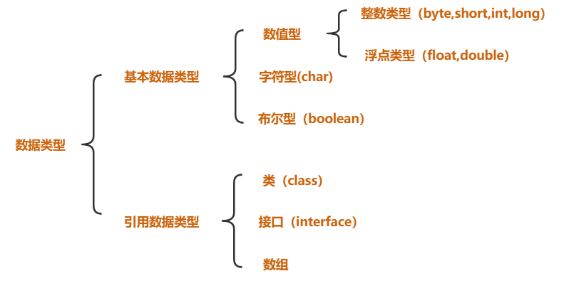
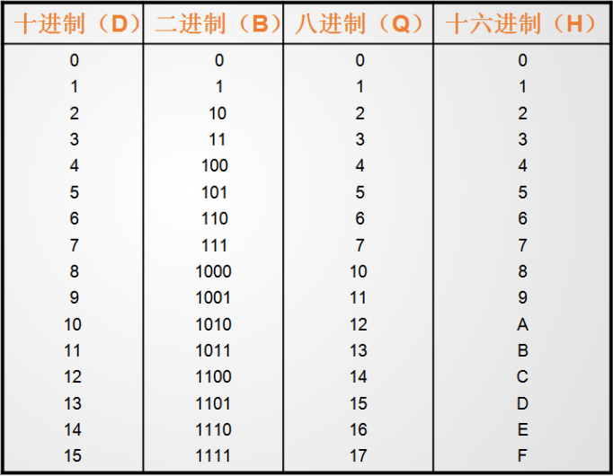
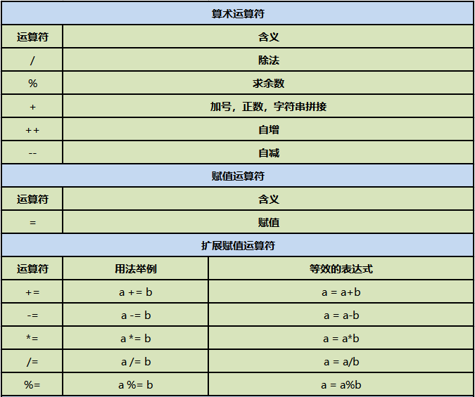
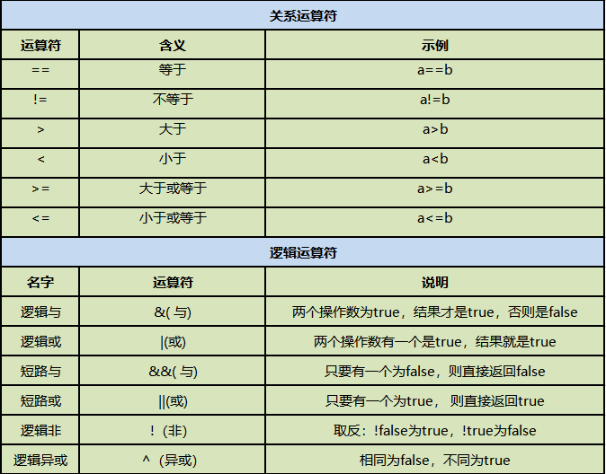
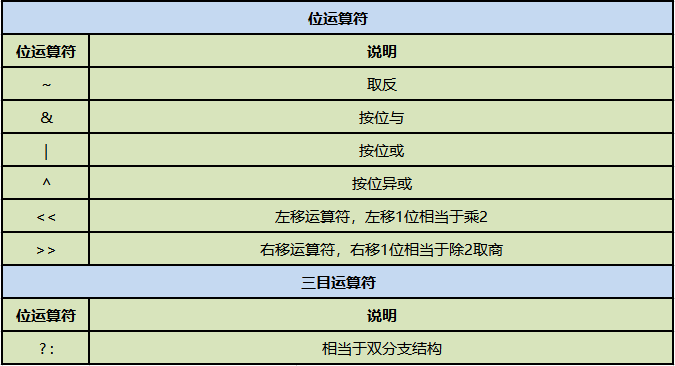
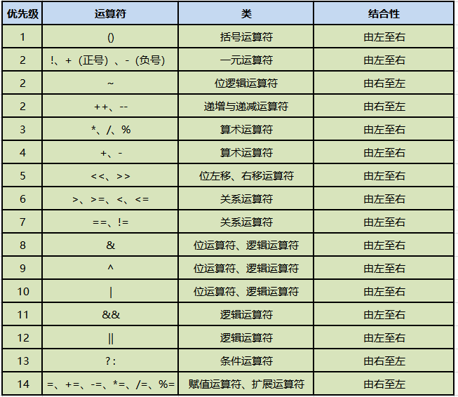

# 数据类型

## 标志符

- 标识符：读音 biao zhi fu
- 什么是标识符？包，类，变量，方法.....等等,只要是起名字的地方,那个名字就是标识符
- 标识符定义规则：
    - 1.四个可以（组成部分）：数字，字母，下划线_，美元符号$ 注意：字母概念比较宽泛，指的是英文字母，汉字，日语，俄语...... 一般起名字尽量使用英文字母
    - 2.两个不可以：不可以以数字开头，不可以使用java中的关键字
    - 3.见名知意：增加可读性
    - 4.大小写敏感：  `int a ; int A;`
    - 5.遵照驼峰命名：
        - 类名：首字母大写，其余遵循驼峰命名
        - 方法名，变量名：首字母小写，其余遵循驼峰命名
        - 包名：全部小写，不遵循驼峰命名
    - 6.长度无限制，但是不建议太长

---

## 关键字

关键字：被JAVA语言赋予了特殊含义，用作专门用途的单词

特点：JAVA中所有关键字都为小写

官网:<https://docs.oracle.com/javase/tutorial/java/nutsandbolts/_keywords.html>


## 常量

常量分为两种： 常量通常指的是一个固定的值，例如：1、2、3、’a’、’b’、true、false、”helloWorld”等。

在Java语言中，主要是利用关键字final来定义一个常量。 常量一旦被初始化后不能再更改其值。
<br>
为了更好的区分和表述，一般将1、2、3、’a’、’b’、true、false、”helloWorld”等称为**字面常量**，而使用final修饰的PI等称为**符号常量**（字符常量）。

注意：逻辑常量就两个值，一个是true，一个是false

## 变量

- 变量声明格式：
  > ` type varName [=value][,varName[=value]...];`[ ]中的内容为可选项，即可有可无
  `    int     age = 19 , age2 = 90 ; int  age,age2;`
- 变量的声明：
    - （1）定义一个变量，没有给变量进行赋值，变量相当于没有定义：
    - （2）变量如果没有进行赋值的话，那么使用的时候会出错
- 变量的赋值: `int age = 10;`
    - 变量的值可以更改：
    - 变量不可以重复定义：
- 变量的作用域：作用域指的就是作用范围，有效作用范围就是离它最近的{}

## 基本数据类型

> Java是一种强类型语言，每个变量都必须声明其数据类型。

> Java的数据类型可分为两大类：基本数据类型`（primitive data type）`和引用数据类型`（reference data type）`。



### 整数类型

    十进制整数，如：99, -500, 0

    八进制整数，要求以 0 开头，如：015

    十六进制数，要求 0x 或 0X 开头，如：0x15

    二进制：要求0b或者0B开头，如：0b11



### 整型数据类型：


```java    
    //定义整数类型的变量：
    //给变量赋值的时候，值可以为不同进制的：
    int num1 = 12 ;     //默认情况下赋值就是十进制的情况
    int num2 = 012;     //前面加上0，这个值就是八进制的
    int num3 = 0x12;    //前面加上0x或者0X，这个值就是十六进制的
    int num4 = 0b10;    //前面加上0b或者0B,这个值就是二进制的
    //定义byte类型的变量：
    byte b = 126;       //定义了一个byte类型的变量，名字叫b，赋值为12
    //注意：超范围的赋值会报错。
    short s = 30000;    //报错
    
    int i = 1234;
    //整数类型默认就是int类型的，所以12345678910是一个int类型的数，对于int类型来说，它超出范围了
    //要想把一个数给long类型变量，那么后面加上L(推荐)或者l就可以了
    long num5 = 12345678910L;
    //注意：只有这个数超出int类型的范围了后面才需要加上L，否则无需加L也可以赋值给long类型：
    long num6 = 12;
```

### 浮点类型

（1）十进制数形式，例如:

    3.14       314.0      0.314

（2）科学记数法形式，如

```java 
    314e2      314E2 (E的大小写没有区分)    314E-2
    double  f = 314e2;  //314*10^2-->31400.0
    double  f2 = 314e-2; //314*10^(-2)-->3.14
```

> float类型又被称作单精度类型，尾数可以精确到7位有效数字，在很多情况下，float类型的精度很难满足需求。

> 而double表示这种类型的数值精度约是float类型的两倍，又被称作双精度类型，绝大部分应用程序都采用double类型。

> float类型的数值有一个后缀F或者f ，没有后缀F/f的浮点数值默认为double类型。 也可以在浮点数值后添加后缀D或者d， 以明确其为double类型。


```java 
    //浮点类型的常量有两种形式：
    //十进制形式：
    double num1 = 3.14;
    //科学计数法形式：
    double num2 = 314E-2;
    //浮点类型的变量：
    //注意：浮点型默认是double类型的，要想将一个double类型的数赋给float类型，必须后面加上F或者f
    float f1 = 3.14234567898623F;
    //注意：double类型后面可以加D或者d，但是一般我们都省略不写
    double d1 = 3.14234567898623D;
    //注意：我们最好不要进行浮点类型的比较：
    float f2 = 0.3F;
    double d2 = 0.3;
    /*
    区别：
    = 赋值运算：  将等号右侧的值赋给等号左侧
    == 判断==左右两侧的值是否相等  ：结果要么相等 要么不相等
    ==运算符的结果就是要么是true，要么是false
    */
```

### 字符类型

```java
    char b='B';
    char c='c';
    char a='我';
```

【1】Java中使用单引号来表示字符常量，字符型在内存中占2个字节。char 类型用来表示在Unicode编码表中的字符。Unicode编码被设计用来处理各种语言的文字，它占2个字节，可允许有65536个字符。

【2】转义字符：


【3】ASCII表：


#### 编码和字符集

> 编码是信息从一种形式或格式转换为另一种形式的过程，也称为计算机编程语言的代码简称编码。用预先规定的方法将文字、数字或其它对象编成数码，或将信息、数据转换成规定的电脉冲信号。编码在电子计算机、电视、遥控和通讯等方面广泛使用。编码是信息从一种形式或格式转换为另一种形式的过程。解码，是编码的逆过程。

**由权威机构形成的编码表才可以称之为：字符集**

| ASCII     | 英文字符集       | 用一个字节的7位表示     |
| :---      |    :----:      |          ---: |
| IOS8859-1 | 西欧字符集       | 用一个字节的8位表示   |
| GB2312    | 简体中文字符集| 最多使用两个字节编码|
| Unicode   |国际通用字符集| |

UTF标准：

三种编码方案： UTF-8，UTF-16,UTF-32


### 布尔类型

    //创建一个布尔类型的变量：
    boolean flag1 = true;
    boolean flag2 = false;
    boolean flag3 = 5==9; //false
    boolean flag4 = 5<9;  //true

**基本数据类型的转换**

【1】什么是类型转换： 在赋值运算或者算数运算的时候，要求数据类型一致，就要进行类型的转换。

【2】类型转换的种类： 自动转换，强制转换

    //类型转换的两种形式：
    double d = 6;   //int-->double  自动类型转换
    int i = (int)6.5;   //double--->int  强制类型转换 （强转）
    //在同一个表达式中，有多个数据类型的时候，应该如何处理：
    //多种数据类型参与运算的时候，整数，浮点，字符类型都可以参与运算，
    //唯独布尔类型不可以参与运算。
    double d2 = 12+1294L+8.5F+3.81+'a'+true;
    double d2 = 12+1294L+8.5F+3.81+'a';

    类型级别：(从低到高的)
    byte,short,char-->int--->long--->float--->double
    当一个表达式中有多种数据类型的时候，要找出当前表达式中级别最高的那个类型，然后
    其余的类型都转换为当前表达式中级别最高的类型进行计算。
    double d2 = 12+1294L+8.5F+3.81+'a';
    double d2 = 12.0+1294.0+8.5+3.81+97.0
    int i2 = (int)(12+1294L+8.5F+3.81+'a');

    /*
    在进行运算的时候：
    左=右  : 直接赋值
    左<右  ：强转
    左>右  ：直接自动转换
    */
    //以下情况属于特殊情形：对于byte，short，char类型来说，
    //只要在他们的表数范围中，赋值的时候就不需要进行
    //强转了直接赋值即可。
    byte b = 12;
    byte b2 = (byte)270;

## 运算符

Java 语言支持如下运算符：

- 算术运算符 +，-，*，/，%，++（自增），--（自减）
- 赋值运算符 =
- 扩展赋值运算符 +=，-=，*=，/=
- 关系运算符 >，<，>=，<=，==，!=
- 逻辑运算符 &，|，&&，||，!，^
- 位运算符 &，|，^，~ ， >>，<<，>>> (了解！！！)
- 条件运算符(三目运算符) ? :

### 位运算符

- `<< 左移 :   3 << 2 = 12 ; -3 << 2 = -12`
- `>> 有符号右移 : 6 >> 2 = 1 ; -6 >> 2 = -2`
- `>>> 无符号右移 : 6 >>> 2 = 1 ; -6 >>> 2 = 1073741822(X)`
- `& 与 : 6 & 3 = 2`
- `| 或 : 6 | 3 = 7`
- `^ 异或 : 6 ^ 3 = 5`
- `~ 反 : ~6 = -7`

```
PS：

byte类型的表数范围的 -128是怎么算出来的 
127： 01111111
-128：  10000000
一看就是个负数
减1：    01111111
取反：   10000000  ---> 2^7  = 128
加负号：  -128
```

### 运算符总结





### 运算符优先级



## 流程控制

- 流程控制的作用： 用来控制程序中各语句执行顺序的语句，可以把语句组合成能完成一定功能的小逻辑模块。
- 控制语句的分类： 顺序、选择和循环。

  “顺序结构”代表“先执行a，再执行b”的逻辑。

  “条件判断结构”代表“如果…，则…”的逻辑。

  “循环结构”代表“如果…，则再继续…”的逻辑。


### 分支结构

- 单分支
  ```
    if(布尔表达式){
    语句块
    }
  if语句对布尔表达式进行一次判定，若判定为真，则执行{}中的语句块，
  否则跳过该语句块。
  ```

- 多分支
  ```
    if(布尔表达式1) {
            语句块1;
    } else if(布尔表达式2) {
            语句块2;
    }......
    else if(布尔表达式n){
            语句块n;
    } else {
            语句块n+1;
    }
  当布尔表达式1为真时，执行语句块1；否则，判断布尔表达式2，当布尔表达式2为真时，执行语句块2；
  否则，继续判断布尔表达式3······；如果1~n个布尔表达式均判定为假时，则执行语句块n+1
  ```
- 双分支
  ```
    if(布尔表达式){
    语句块1
    }else{
    语句块2
    }
  当布尔表达式为真时，执行语句块1，否则，执行语句块2。
  ```
- switch多分支结构
    ```
      switch (表达式) {
      case 值1:
         语句序列1;
         [break];
      case 值2:
         语句序列2;
         [break];
        … … …      … …
      [default:默认语句;]
      }
  switch语句会根据表达式的值从相匹配的case标签处开始执行，
  一直执行到break语句处或者是switch语句的末尾。
  如果表达式的值与任一case值不匹配，
  则进入default语句（如果存在default语句的情况）。
  根据表达式值的不同可以执行许多不同的操作。
  switch语句中case标签在JDK1.5之前必须是整数（long类型除外）
  或者枚举，不能是字符串，在JDK1.7之后允许使用字符串(String)。
  大家要注意，当布尔表达式是等值判断的情况，
  可以使用if-else if-else多分支结构或者switch结构，
  如果布尔表达式区间判断的情况，
  则只能使用if-else if-else多分支结构。
    ```

### 循环结构

- while
    ```
    while (布尔表达式) {
            循环体;
    }
  ```

- do while
    ```
  do {
            循环体;
    } while(布尔表达式) ;
  ```

- for
    ```
    for (初始表达式; 布尔表达式; 迭代因子) {
          循环体;
    }
  ```

**循环关键字**

**break 停止循环**

```java
//break带标签的使用
public class TestFor04 {
    public static void main(String[] args) {
        outer:
        //----》定义标签结束的位置
        for (int i = 1; i <= 100; i++) {
            System.out.println(i);
            while (i == 36) {
                break outer;    //----》根据标签来结束循环
            }
        }
    }
}
```

**continue 结束本次循环，继续下一次循环**

```java
//continue带标签的使用
public class TestFor07 {
    public static void main(String[] args) {

        outer:
        for (int i = 1; i <= 100; i++) {
            while (i == 36) {
                continue outer;  //1-100没有36
            }
            System.out.println(i);
        }
    }
}
```

**return 跟循环无关 结束当前方法**

## 方法的定义/调用/重载

- 什么是方法？ 方法(method)就是一段用来完成特定功能的代码片段，类似于其它语言的函数(function)。 方法用于定义该类或该类的实例的行为特征和功能实现。
  方法是类和对象行为特征的抽象。方法很类似于面向过程中的函数。面向过程中，函数是最基本单位，整个程序由一个个函数调用组成。面向对象中，整个程序的基本单位是类，方法是从属于类和对象的。
- 方法声明格式：

```
[修饰符1  修饰符2  …]  返回值类型    方法名(形式参数列表){
        Java语句；… … …
}
```

- 方法的调用方式

```
对象名.方法名(实参列表)
```

**方法的详细说明**
形式参数：在方法声明时用于接收外界传入的数据。

实参：调用方法时实际传给方法的数据。

返回值：方法在执行完毕后返还给调用它的环境的数据。

返回值类型：事先约定的返回值的数据类型，如无返回值，必须显示指定为为void。

**方法重载**

- 方法的重载：在同一个类中，方法名相同，形参列表不同的多个方法，构成了方法的重载。

- 方法的重载只跟：方法名和形参列表有关，与修饰符，返回值类型无关。
- 注意：形参列表不同指的是什么？
    - 个数不同 add()   add(int num1)   add(int num1,int num2)
    - 顺序不同 add(int num1,double num2)   add(double num1,int num2)
    - 类型不同 add(int num1)   add(double num1)

## 数组

数组的初始化方式总共有三种：

- 静态初始化 : `int[] arr = {12,23,45}; int[] arr = new int[]{12,23,45};`
- 动态初始化 : `int[] arr ; arr = new int[3]:; arr[0] = 12;`
- 默认初始化 : `int[] arr = new int[3]; // 数组有默认的初始化值`

### 详述main方法

【1】main方法：程序的入口，在同一个类中，如果有多个方法，那么虚拟机就会识别main方法，从这个方法作为程序的入口

【2】main方法格式严格要求：

```
public static void main(String[] args){}

public static --->修饰符

void --->代表方法没有返回值 对应的类型void

main --->见名知意名字

String[] args  --->形参  ---》不确定因素
```

【3】问题：程序中是否可以有其他的方法也叫main方法？ 可以，构成了方法的重载。

**可变参数**

```
  1.可变参数：作用提供了一个方法，参数的个数是可变的 ,解决了部分方法的重载问题
  int... num
  double... num
  boolean... num
  
  
  2.可变参数在JDK1.5之后加入的新特性
  3.方法的内部对可变参数的处理跟数组是一样
  4.可变参数和其他数据一起作为形参的时候，可变参数一定要放在最后
  5.我们自己在写代码的时候，建议不要使用可变参数。
```

**Arrays工具类**

```
int[] arr = {1,3,7,2,4,8};
//toString:对数组进行遍历查看的，返回的是一个字符串，这个字符串比较好看
Arrays.toString(arr);

//sort：排序 -->升序
Arrays.sort(arr);

//binarySearch:二分法查找：找出指定数组中的指定元素对应的索引：
//这个方法的使用前提：一定要查看的是一个有序的数组：
Arrays.binarySearch(arr,4)

//copyOf:完成数组的复制：
int[] newArr = Arrays.copyOf(arr2,4);

//copyOfRange:区间复制
int[] newArr2 = Arrays.copyOfRange(arr2,1,4);   //[1,4)-->1,2,3位置

 //equals:比较两个数组的值是否一样：
int[] arr3 = {1,3,7,2,4,8};
int[] arr4 = {1,3,7,2,4,8};
Arrays.equals(arr3,arr4);   //true

//fill：数组的填充：
int[] arr5 = {1,3,7,2,4,8};
Arrays.fill(arr5,10);

```

### 二维数组

```java
public class TestArray15 {
    public static void main(String[] args) {
        //定义一个二维数组：
        int[][] arr = new int[3][];
        //本质上定义了一个一维数组，长度为3

        int[] a1 = {1, 2, 3};
        arr[0] = a1;

        arr[1] = new int[]{4, 5, 6, 7};

        arr[2] = new int[]{9, 10};
    }
}

```